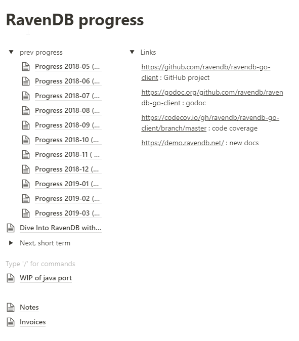
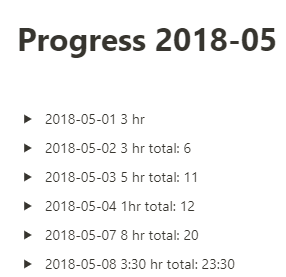

[TOC]

# 将50k的Java代码移植到Go的经验总结

## 编写目的

> 将[**Lessons learned porting 50k loc from Java to Go**](https://blog.kowalczyk.info/article/19f2fe97f06a47c3b1f118fd06851fad/lessons-learned-porting-50k-loc-from-java-to-go.html)翻译成中文.

## 修改记录

|    日期    | 描述 | 版本  |  作者  | 审核 |
| :--------: | :--: | :---: | :----: | :--: |
| 2019-05-11 | 创建 | 0.0.1 | 胡光辉 |      |

## 内容

我受雇将一个大型的Java代码移植成Go.

相关代码是一份RavenDB客户端,一个NoSQL的json文档数据库, 有将近50k行的代码.

目的是要转换成Go方式的客户端.

写下这篇文章记录在这个过程中学到的东西.

### 测试和代码覆盖率

自动化测试和追踪代码覆盖率对大型项目有很大的好处.

我使用TravisCI和AppVeyor做自动化测试.Codecov.io用于追踪代码覆盖率.也可以使用其它方式.

一年前Travis不支持windows和AppVeyor不支持Linux,所以我同时使用TravisCI和AppVeyor作为自动化测试.

如果今天从头开始,我将只会选择使用AppVeyor,因为它同时在Linux和Windows上运行自动化测试.TravisCI被私募股权公司收购，据报道解雇了原来的开发团队, 未来的走向未知.

Codecov勉强够用.对于Go语言,它会把不会执行的非代码行算进来.正如工具所说,不可能获取到100%的代码覆盖率.Coveralls 似乎有同样的问题.

它总比没有好，但是有机会做得更好，特别是对于Go项目.

### Go的竞争检测器

部分代码使用了并发.很容易出现并发错误.

Go提供了在编译期间可以使用-race标志启用的竞争检测器.

这样减慢了程序的速度.额外检测可以帮助我们检测到我们并发修改同一个内存位置.

我在运行测试时,总是会开启-race项.它提醒我有很多竞争,让我能及时修复.

### 为测试编译定制工具

在大型项目中,通过检查来确保程序的正确性几乎是不可能的.需要在大脑中保持太多代码.

当测试失败时,从失败信息中找出失败原因是一件比较困难的事情.

数据库客户端驱动程序通过HTTP与RavenDB数据库服务器通过JSON方式通信.

在将Java测试移植到Go, 可以对比一下java和Go方式的HTTP流量.

我编译了一个工具帮我完成那些工作.

为了在Java客户端上抓取到HTTP流量,我使用Go编译了一个[loggging HTTP proxy](<https://github.com/kjk/httplogproxy>)工具.定向Java客户端使用该HTTP代理.

对于Go的客户端,我编译了一个[ a hook in the library](https://github.com/ravendb/ravendb-go-client/blob/20fade9ee6d22d60c7babf4a155c4de5bf4cfd3b/request_executor.go#L23)可以截取到HTTP请求.我使用它将HTTP流量记录到文件中.

这样我就能比较Java客户端和移植后的Go的HTTP流量,指出他们的区别.

### 移植过程

我们不能盲目的开始50k行Java代码移植到Go.如果没有一点一点的测试和验证,我肯定会被复杂度整崩溃.

我对RavenDB和Java基础都很陌生.第一步我需要对Java的工作原理有更深的了解.

这个客户端的核心是通过HTTP协议与服务端通信.我抓取交互,查看它,写最简单的Go代码与服务器通信.

当这些生效,会对我复制功能带来很大信心.

我第一个达到的里程碑是移植足够的代码,达到能简单的Java测试代码.

我使用了至下而上和自上而下的方法.

定位发送请求和解析请求的地方我使用自下而上的方法.

我使用自上而下的方法处理逐步完成移植测试确定移植代码的哪些部分完成那些功能.

在完成第一次测试移植后,剩余的工作就是一次移植一次测试.所有必要的代码都要测试运行起来.

当所有完成所有测试移植和验证通过, 我做了一些改进让我的代码更加Go-ish.

我认为完成这个工作, 一步一步逐渐去靠近是很重要的.

当遇到周期一年长的工程, 从心里上,划分为更小的阶段性的工作量会更好些.这样做会让我更有动力.

让代码随时能够编译,运行和测试通过是很好的一个习惯.让bug积累起来,最后会越来越难去解决它.

### 移植Java到Go的挑战

这次移植的目的是让移植后的代码尽可能的靠近Java代码库,因为之后还要与Java库更新进行同步.

对那些我需要逐行翻译的代码量我感到很惊讶.这个移植的大部分时间花在将Java和Go的变量类型转换上.我希望能有个工作能完成这个工作量.

#### String vs. string

在Java中,String是一个指针object.所以一个字符串可以为null.

在Go中,string是一个值类型,它不能为nil.只能是空.

这个不是一个大问题.在大多数情况下,我可以直接使用""替换null.

#### Errors vs. exceptions

Java使用exceptions处理errors.

Go使用error接口作为返回值.

虽然这个移植起来不是很困难, 但是还是需要改动很多函数返回值,设到堆栈中.

#### Generics(泛化)

Go中目前还没有泛化.

移植泛化接口是一个极大的挑战.

下面是Java中的泛化方法定义

```java
public <T> T load(Class<T> clazz, String id) {}
```

调用为

```java
Foo foo = load(Foo.class, "id")
```

在Go中我使用了两个策略.

第一个是使用结合value和type的interface{},和java中的object有点相似.这不是最佳策略.虽然它可以工作,在interface{}上操作,对使用库的用户来说是笨拙的.

在一些情况下,我使用reflection.上面代码可以指移植为

```go
func Load(result interface{}, id string) error
```

我能使用reflection去知道result的类型, 从JSON文档中创建该类型的值.

像这样调用

```go
var result *Foo;
err := Load(&result, "id")
```

#### Function overloading

Go也没有这个功能(可能永远都不会有).

我不能说我找了一个很好的方法去移植它们.

有些情况下,overloading可以用于创建短期帮助.

```java
void foo(int a, String b) {}
void foo(int a) { foo(a, null); }
```

有时我会放弃短期助手.

有时我写两个函数:

```go
func foo(a int) {}
func fooWithB(a int, b string) {}
```

当传递参数很大时,我会这么做:

```go
type FooArgs struct {
    A int
    B string
}
func foo(args *FooArgs) {}
```

### Inheritance(继承)

Go不是特别面向对象语言,没有Inheritance.

简单的继承样例可以通过嵌入移植.

```java
class B:A {}
```

可以移植为

```go
type A struct {}
type B struct {
    A
}
```

我们将A内嵌到B中,因此B继承了A的所有方法.

这对虚函数是无效的.

对于虚函数的代码移植目前没有好的办法.

模拟虚函数的一个方法是使用嵌入结构和函数指针.这样基本上重新实现了Java作为对象实现的一部分免费提供的虚拟表.

另一种方法是写一个独立的函数对给定类型调度正确函数.

#### Interfaces

虽然Java和Go有Interfaces,但他们不是同一个东西,就像苹果和沙拉米香肠.

有几次我创建了一个复制Java接口的Go接口类型.

在更多情况下,我删除了接口,而是在API中暴露了具体的接口.

### Circular imports between packages(包之间的循环导入)

Java允许包之间的循环导入.而Go没有.

因此我在移植过程中不能复制包中的结构体.

为了简单化,我只使用了一个包.这边变成了一个非常大的包,有点不太理想.实际上,Go1.10无法在Windows上的单个软件包中处理如此多的源文件.比较幸运的是,Go1.11修改了这个问题.

### Private, public, protected(私有,公共,受保护)

Go的设计者们对此没有太多重视.他们在此方面做了极大的简化,访问控制就是其中一部分.

其他语言倾向于细化处理访问控制:对于每个类中的方法和成员都必须指定共有,私有或受保护.

因此,一个实现了一些功能库有同样的权限对于在这个库中使用这个库的扩展代码.

Go中只有共有,私有和范围访问包级别.

这样做更有意义.

当我写了一个显示和解析markdown的库时,我不太想暴露库的内部实现给用户.但是隐藏这些内部实现会适得其反.
Java程序注意到了这个问题.有时使用接口来作为黑客来修复过度暴露的类.通过接口返回来替代一个具体的类,你可以隐藏一些指导该用户的公共API.

#### Concurrency(并发)

Go的并发性是最好的.一个内嵌的竞争检测器在排除并发错误起很大作用.

话虽如此,在我第一个移植传递中我使用了模拟JavaAPIs.举个例子,我实现了一个Java的CompletableFuture类的拷贝.

只有在代码生效后,我才会把它重构为Go惯用的方式.

#### Fluent function chaining(流程的功能链)

RavenDB有非常复杂的查询能力.Java客户端使用方法链来构建.

```java
List<ReduceResult> results = session.query(User.class)
    							.groupBy("name")
    							.selectKey()
    							.selectCount()
    							.orderByDescending("count")
    							.ofType(ReduceResult.class)
    							.toList();
```

这只会在那些通过exceptions来处理errors的编程语言中生效.当一个函数另外返回错误时, 像那样链式使用它是不可能的.

为了在Go中使用链式方式,我使用了一个"stateful error"的方法.

```go
type Query struct {
    err error
}

func (q *Query) WhereEquals(field string, val interface{}) *Query {
    if q.err != nil {
        return q
    }
    // logic that might set q.err
    return q
}

func (q *Query) GroupBy(field string) *Query {
    if q.err != nil {
        return q
    }
    // logic that might set q.err
    return q
}

func (q *Query) Execute(result interface{}) error {
    if q.err != nil {
        return q
    }
    // do logic
}
```

就可以这样使用链式

```go
val resutl *Foo
err := NewQuery().WhereEquals("Name", "Franks").GroupBy("Age").Execute(&result)
```

#### JSON marshaling(JSON封装)

Java没有内嵌的JSON封装,这个客户端使用了一个Jackson的JSON库.

Go在标准库中支持JSON,但是它并没有为调整的封装处理提供太多的钩子.

我没有尝试去匹配Java的所有功能,因为Go提供的内置JSON支持,是非常灵活的.

#### Go code is shorter(Go代码更简短)

这不是Java的一个属性,而是决定什么是惯用代码的文化.

在Java中setter和getter方法是公用的.因此，Java代码可以这么写:

```Java
class Foo {
    private int bar;
    
    public void setBar(int Bar) {
        this.bar = bar;
    }
    
    public int getBar() {
        return this.bar;
    }
}
```

在Go中可以这么写:

```go
type Foo struct {
    Bar int
}
```

3行对11行,如果你有很多成员的很多类会增大很大的代码量.

大多数其他代码具有相同的长度.

#### 使用Notion来管理这个工作

我是[Notion](<https://www.notion.so/>)的重度使用者.简单的来说, Notion是一个分级的笔记应用程序.想一想Evernote和wiki,由顶尖的软件设计师精心设计和实施.

下面是我如何使用Notion在Go移植上开展工作的方法:



这就是那些东西:

- 上面没有显示出来, 我有个页面,我在那里简要记录我在某一天工作的内容以及我花费的时间.这是一个很重要的信息,因为这是按小时来算的.感谢这些笔记,我知道我花了11个月的601个小时
- 客户喜欢了解进展情况.我每个月都有一个页面,我总结了这样做的工作:



这些信息可以在客户端上进行共享:

- 短期待办事项列表有助于每天开展的工作


- 我甚至将发票管理为Notion页面,并使用"导出到PDF"功能生成PDF版本的发票

#### 聘请Go程序员

如果你的公司需要额外的Go编程帮助.你可以雇佣我.

#### 其他信息

我在回答问题时,提供了一些额外的评论:

- 在 [Hacker News discussion](https://news.ycombinator.com/item?id=19589614)
- 在[/r/golang discussion](https://old.reddit.com/r/golang/comments/ba0lsm/lessons_learned_porting_50k_loc_from_java_to_go/)

其他资料

- 如果你需要一个NoSQL, JSON格式数据库,请尝试[RavenDB](<https://ravendb.net/>).它充满了先进的功能.
- 如果你在使用Go编程, 试试免费的[高效Go编程](<https://www.programming-books.io/essential/go/>)书籍
- 如果你对Notion感兴趣,我是这个世界上对Notion使用最熟悉的人:
  - 我[逆向工程过NotionAPI](<https://blog.kowalczyk.info/article/88aee8f43620471aa9dbcad28368174c/how-i-reverse-engineered-notion-api.html>)
  - 对于NotionAPI我写过一个[非官方的Go库](<https://github.com/kjk/notionapi>)
  - 这个网站上的所有内容都是在Notion上写的,使用我[自制的工具链](<https://blog.kowalczyk.info/article/a8cf04d756ec4963905960822b004440/powering-a-blog-with-notion-and-netlify.html>)发布.


写于2019-04-05