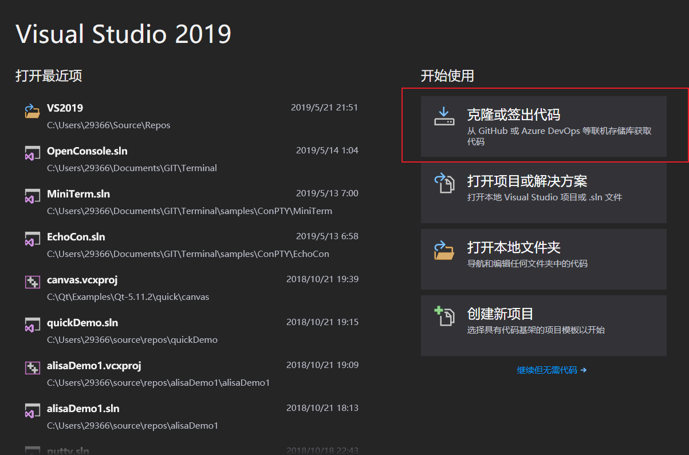
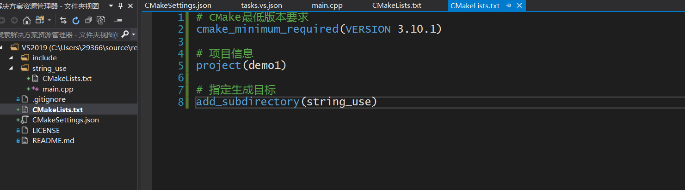
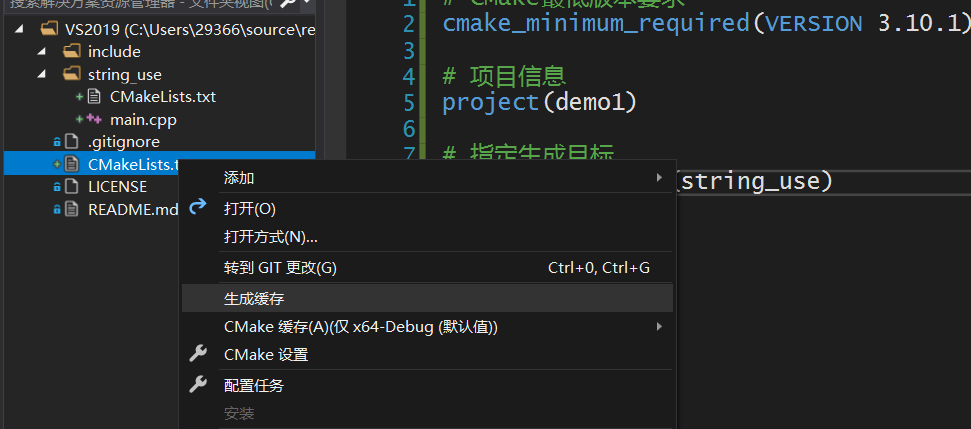
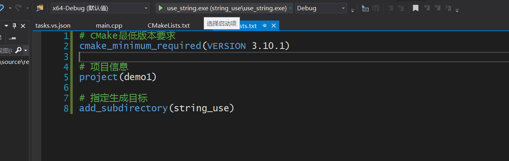
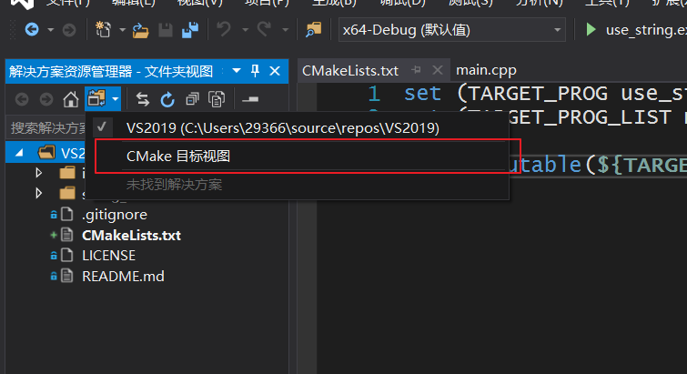

[TOC]

# VS2019加Cmake

## 环境

**Visual Studio 16 2019**

**cmake version 3.11.18040201-MSVC_2**

注意:

cmake 3.14才支持Visual Studio 16 2019的生成

## 基础使用

### 1. 使用Visual Studio2019中的 “ 克隆或签出代码 ”

### 2.  在根目录下创建CMakeLists.txt和测试代码

### 3. 根据根目录下的CMakeLists.txt生成缓存

### 4.运行生成的程序

> 此时也可以通过加断电进行调试.

### 5. 在资源管理器中可以切换到CMake的目标视图

