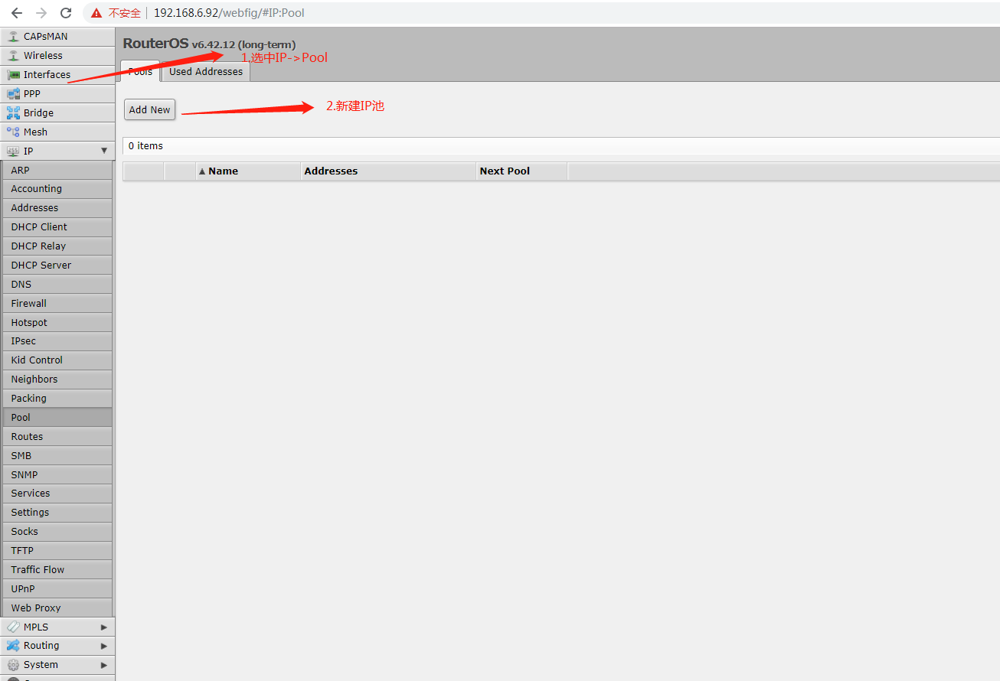
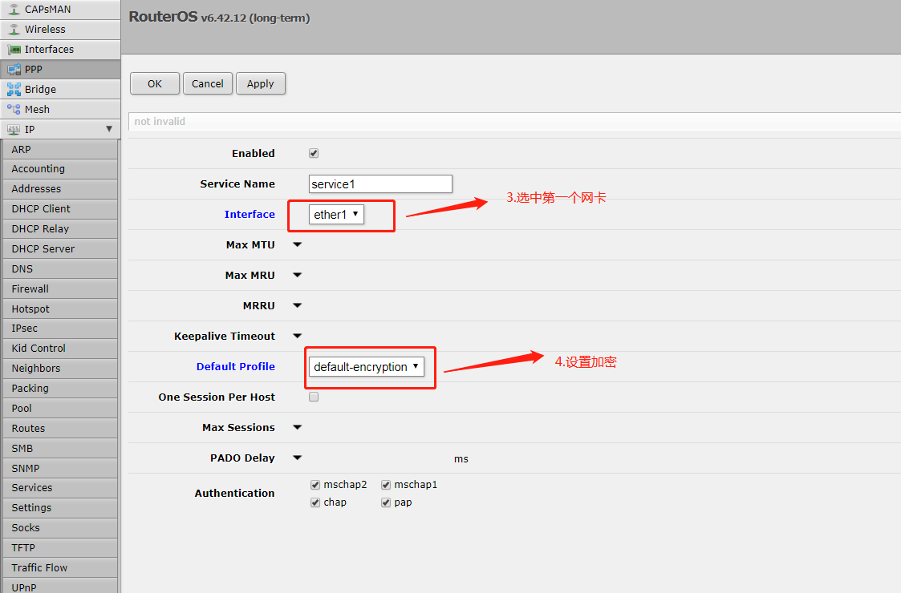

[TOC]

# ROS

## 链接

[mikrotik](https://mikrotik.com/download)

## 相关资源下载

[vdi和WinBox的下载](https://mikrotik.com/download)

## 使用VirtualBox搭建

### 通过vdi创建虚拟电脑

### 配置映射网卡

> 至少配置两个桥接网卡,一个作为lan-ether1, 一个作为wan-ether2

### 配置地址

- 虚拟机登陆, 账号: admin 密码:空
- 配置第一个映射网卡ether1的地址, ip address add address=192.168.6.92/24 interface=ether1
- 测试是否设置成功,在PC上 ping 192.168.6.92

### 参数配置

> 用两种方式对参数进行配置:1.网页方式,2.winbox方式

## 功能使用

### pppoe测试环境的搭建

#### 创建IP地址池

#### 创建PPPoE Servers服务

#### 配置Profiles中的default-encryption配置

#### 创建pppoe账号和密码

#### 测试设备拨号功能

设备开启PPPoE功能,填入正确的用户名和密码

RouterOS上可以显示出在线用户状态

测试PPPoE功能完成,功能OK