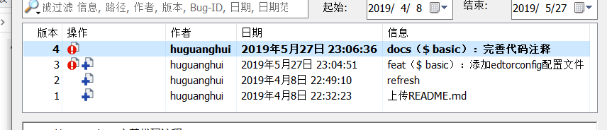

[TOC]

# SVN和GIT使用

## 修改记录

|    日期    |   描述   | 版本  |  作者  | 审核 |
| :--------: | :------: | :---: | :----: | :--: |
| 2019-04-07 | 初始版本 | 1.0.0 | 胡光辉 |      |
|            |          |       |        |      |
|            |          |       |        |      |

[visualsvn入门文档](https://www.visualsvn.com/server/getting-started/)

## SVN

- A 已添加
- D 已删除
- U 已更新
- C 合并冲突
- G 合并成功
- E 已存在
- R 已替换

### 检出

```shell
svn checkout svn路径
```

### 多行上传

```shell
# svn多行上传
$ svn commit -m $'1.测试;\n2.上传文件;\n3.完善注释;\n'
```

### 更新到指定版本

```shell
$svn update -r 200 test.php
```

### 版本回退

#### 版本未提交

```shell
# 回退文件
$ svn revert 文件名
# 取消目录
$ svn revert --depth=infinity 目录名
或
$ svn revert -R 目录
```

#### 版本已提交

> 将版本4回退到版本2



```shell
# 1. 保证当前的是最新的代码
$ svn update 
# 2. 查看日志确定需要回滚的版本号
$ svn log
# 3. 对比两个版本的差异
$ svn diff -r 4:3 ""
# 4. 回滚版本
$ svn merge -r 4:3 ""
# 5. 确认修改
$ svn diff ""
# 6. 提交
$ svn commit -m $'Revert revision from r4 to r25. 测试版本回退流程.'
```

### 显示一个历史版本中指定文件的内容

```shell
$ svn cat -r 版本号 文件
```

### 在不下载文件到本地目录的情况下来察看目录中的文件

```shell
$ svn list https://192.168.3.125/svn/test_svn
```

### 分支的使用(TODO)

```shell

```

### 标签的使用(TODO)

```shell

```

## GIT