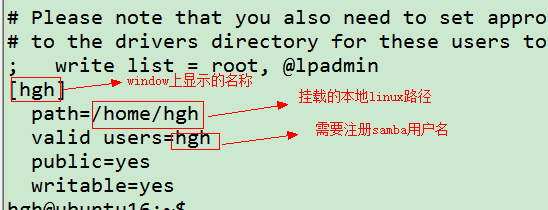
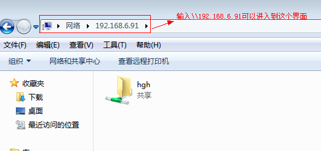
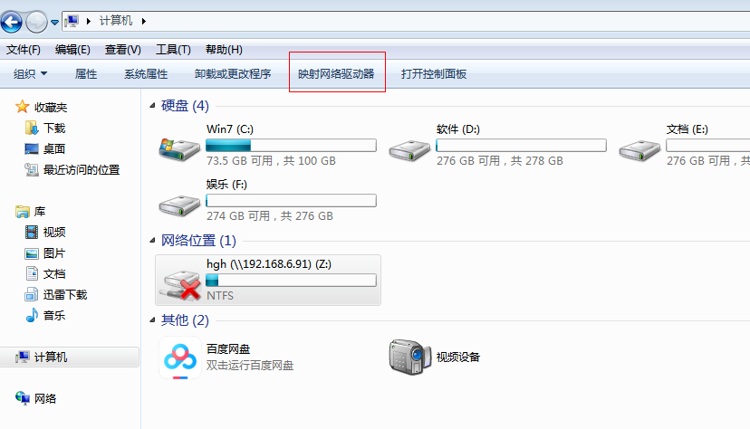
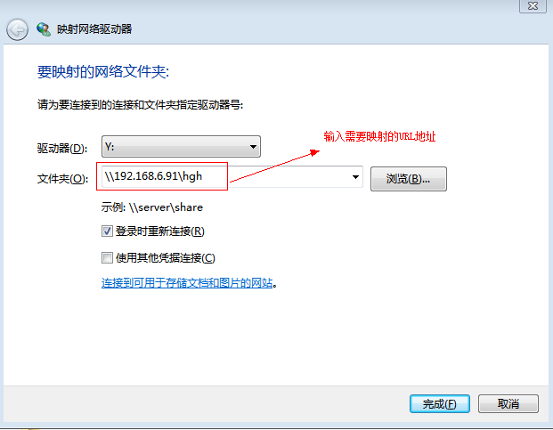

[TOC]

# linux上软件安装

## ssh服务

> 使用secureCRT能远程操作服务器

```shell
$sudo apt-get install openssh-server
```

## samba服务

> 共享ubuntu服务器下的目录,方便windows上直接查看和修改代码.

### 安装

```shell
$sudo apt-get install samba
```

如果安装过程可能出现以下问题

```shell
hgh@ubuntu16:~$ sudo apt install samba
Reading package lists... Done
Building dependency tree       
Reading state information... Done
Some packages could not be installed. This may mean that you have
requested an impossible situation or if you are using the unstable
distribution that some required packages have not yet been created
or been moved out of Incoming.
The following information may help to resolve the situation:

The following packages have unmet dependencies:
 samba : Depends: python-dnspython but it is not installable
         Depends: python-samba but it is not going to be installed
         Depends: samba-common-bin (= 2:4.3.11+dfsg-0ubuntu0.16.04.18) but it is not going to be installed
         Depends: tdb-tools but it is not installable
         Recommends: attr but it is not installable
         Recommends: samba-dsdb-modules but it is not going to be installed
         Recommends: samba-vfs-modules but it is not going to be installed
E: Unable to correct problems, you have held broken packages.
```

解决办法

```shell
$sudo apt update
$sudo apt install build-essential
```

### 配置

修改/etc/samba/smb.conf配置文件,在文件尾添加


添加samba用户,建议和Ubuntu的用户名和密码设置一致.

```shell
$sudo smbpasswd -a hgh
```

### 重启服务

```shell
$sudo service smbd restart
```

### Window上的使用

**进入samba的目录,使用账号和密码打开共享的文件夹**



**将samba的网络地址映射到本地**

windows资源管理器->计算机->映射网络驱动器->输入映射的地址->完成





## tftp服务

> tftp服务主要是用于设备之间的文件传送

### 安装

```shell
# 安装ftfp服务端
$sudo apt-get install tftpd-hpa
# 安装ftfp客户端
$sudo apt-get install tftp-hpa
```

### 服务端的配置

创建tftp服务端的目录

```shell
$cd $HOME
$mkdir tftp_dir
$sudo chmod 777 tftp_dir -R
```

修改/etc/default/tftpd-hpa配置文件

```shell
# /etc/default/tftpd-hpa

TFTP_USERNAME="tftp"
TFTP_DIRECTORY="/home/hgh/tftp_dir"
TFTP_ADDRESS=":69"
TFTP_OPTIONS="-l -c -s"
```

### 重启ftfp服务

```shell
$sudo service tftpd-hpa restart
```

## nfs服务

> 可以将将ubuntu的目录直接挂载在开发设备上,便于调试功能.

### 安装

```shell
$sudo apt-get install nfs-kernel-server
```

### 配置

修改配置文件/etc/exports,添加

```shell
/home/hgh       *(rw,sync,no_subtree_check,no_root_squash)
```

### 重启nfs服务

```shell
$sudo service nfs-kernel-server restart
```

### 使用方法

```shell
# 挂载
$sudo mount -t nfs -o nolock 192.168.6.91:/home/hgh /mnt
# 取消挂载
$sudo umount /mnt
```

## SVN

> 代码管理仓库

### ubuntu上的安装

```shell
$sudo apt-get install subversion
# 查看svn的版本
$ svn --version
svn, version 1.9.3 (r1718519)
   compiled Aug 10 2017, 16:59:15 on x86_64-pc-linux-gnu
```

windows上SVN版本需要与ubuntu上的版本一致.

[资源地址](https://sourceforge.net/projects/tortoisesvn/files/1.9.3/Application/)

### SVN改用beyondcompare配置

```shell
"D:\Program Files (x86)\Beyond.Compare.v3.3.13.18981.exe" %base %mine /title1=%bname /title2=%yname /leftreadonly
```

```shell
"D:\Program Files (x86)\Beyond.Compare.v3.3.13.18981.exe" %mine %theirs %base %merged /title1=%yname /title2=%tname /title3=%bname /title4=%mname
```

## FTP

> 提供文件存储和访问服务.

### vsftpd安装

#### 安装

```shell
# APT方式安装
$ sudo apt-get install vsftpd
```

#### 配置

> /etc/vsftpd.conf

```shell
# 为ftp服务创建用户
$ sudo mkdir /home/ftp_u01
$ sudo useradd –d /home/ftp_u01 –s /bin/zsh ftp_u01
$sudo passwd ftp_u01
```

添加用户管理表

```shell
向文件中追加”userlist_deny=NO
userlist_enable=YES    userlist_file=/etc/allowed_users” 和 ”seccomp_sandbox=NO” 设置文件中的”local_enable=YES” 保存退出即可
其中/etc/ftpusers是不能访问的用户列表
```

#### 使用

```shell
$ sudo service vsftpd restart	重启vsftpd服务器
```

## ubuntu上的终端管理工具

### APT安装

```shell
$ sudo apt-get install terminator
```

### 使用

```shell
# ctrl+shift+e 垂直分割
# ctrl+shift+o 水平分割
# alt+方向键切换
# ctrl+shift+w 关闭分割窗
```

### 相关配置

[参考](https://www.cnblogs.com/hwtblog/p/8438030.html)

## Window上搭建Ftp服务器

[参考](https://www.cnblogs.com/popfisher/p/7992036.html)

