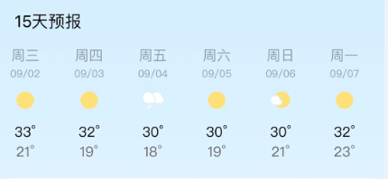
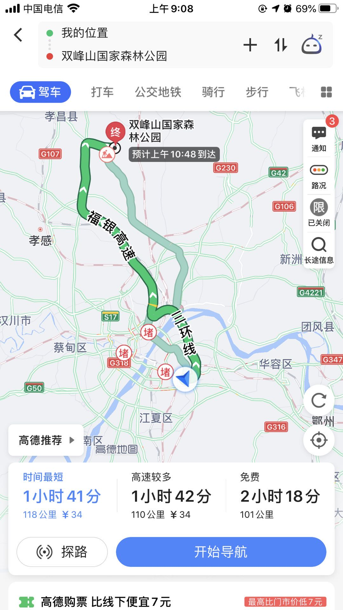
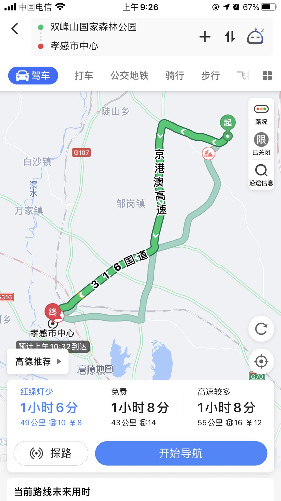

[TOC]

# 孝感双峰山一日游

## 简介

> 双峰山风景区双峰山主峰由两座海拔888米对峙且相邻的山峰组成，其中最高峰高887.3M.

景点级别: 国家AAAA级景区

### 著名景点

> 双峰山森林覆盖率达87%，境内群山连绵，峡谷深幽，溪流环绕，气候宜人，有峡谷探幽、双峰托日、书院听琴、回龙晨钟、凉亭看花、林海听涛、古寨烽烟、白云晓月、万兽朝圣、农家社火、达海洞天、沧海泛舟12个景区

## 图片

[相关链接](https://www.meet99.com/jingdian-shuangfengshan.html)

## 天气

## 交通情况

> 预计2个多小时车程

### 武汉-双峰山

### 双峰山-孝感市区

## 流程安排

### 2020-09-05(周六)

**出发时间：** 07:00 (预计9-10点能到)

**游玩时间：** 10:00 - 16:00

**孝感市吃饭,休息调整：** 17:30 (1个小时的车程)

**动身回武汉：** 19:00

