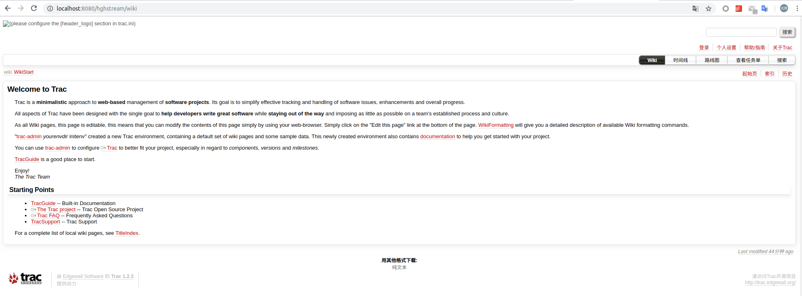

[TOC]

## 目的

> 使用Trac搭建一个可以正式投入使用的项目环境.基于一个C/C++的一个媒体流工程项目管理.

[使用Trac的开源工程](https://trac.edgewall.org/wiki/TracUsers)

## 空项目搭建

```shell
# 创建环境
$ mkdir -p /home/hgh/Trac_project/hghstream
$ trac-admin /home/hgh/Trac_project/hghstream initenv
# 更新
$ trac-admin /home/hgh/Trac_project/hghstream upgrade  
# 配置文件/home/hgh/Trac_project/hghstream/conf/trac.ini
# 试用Web页面环境
$ tracd --port 8000 /home/hgh/Trac_project/hghstream
```



## 插件使用

- [Trac插件](https://trac.edgewall.org/wiki/TracPlugins)
- [插件链表](https://trac.edgewall.org/wiki/PluginList)

### Mercurial插件

- [下载地址](https://trac.edgewall.org/wiki/TracMercurial)

```shell
# 下载
$ pip install TracMercurial
# 配置conf/trac.ini 
[components]
tracext.hg.* = enabled

[repositories]
repository.type = hg
repository.dir = /path/to/my/hg/repository

[hg]
# -- Show revision number in addition to the changeset hash (defaults to yes)
show_rev = yes
# -- Changeset hash format
node_format = short
# hex:   Show the full SHA1 hash 
# short: Show a shortened hash for the changesets (default)
```

