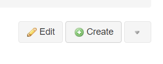
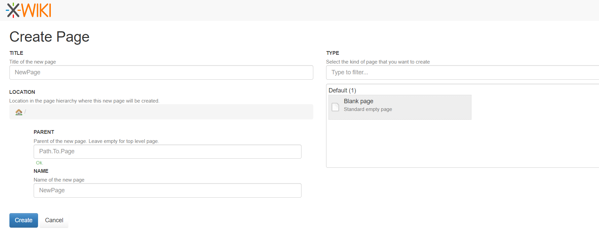
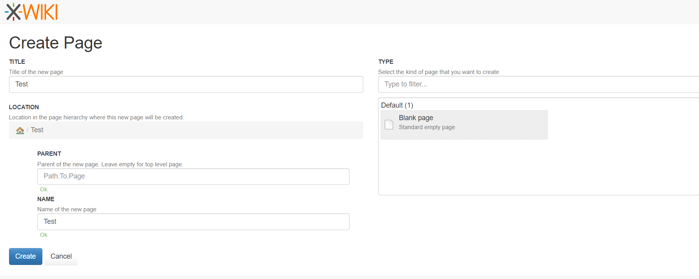
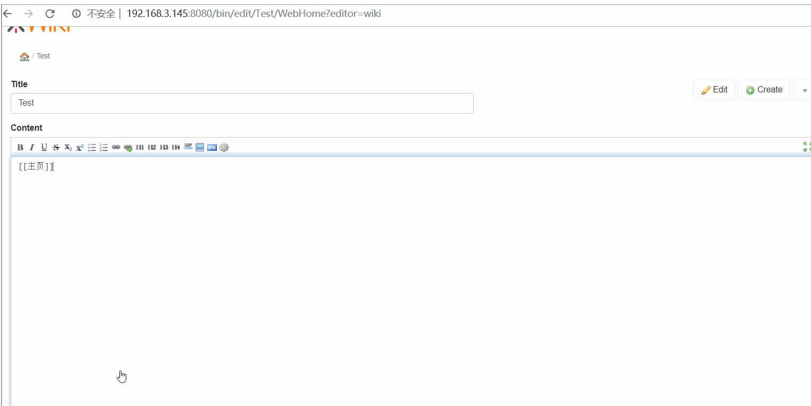
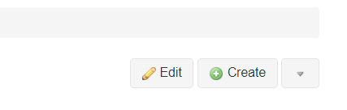
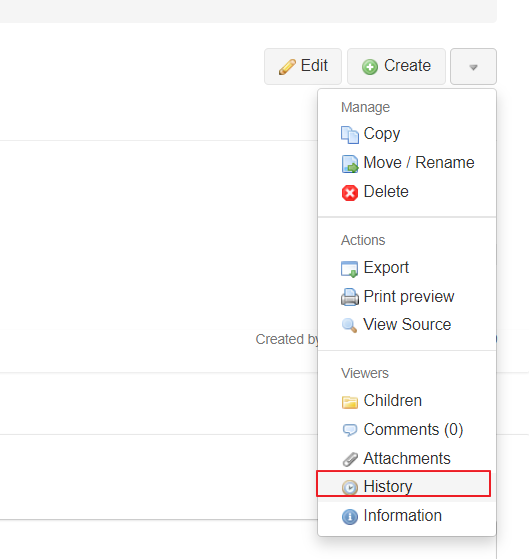

[TOC]

# XWIKI

## 简介

### wiki

> wiki是指可以很便捷在线编辑的网站.当你想编辑一个页面可以直接点击编辑按钮进行修改,然后保存.修改后页面会立即被替换掉.这样可以让网站更新很及时,让其他人也参与进来.被修改的页面会被保存到历史记录中,可以进行版本回退.除了这个基础特性,很多wiki还包含了访问权限管理和订阅等特性.

相比于传统的内容管理系统和ECM,wiki主要优势在于它的灵活性和添加新页面很便捷和被链接.

由于wiki的灵活性和方便使用,可以用于处理各种各样的问题.

-  分享主题信息,主题可以为知识点,产品分类和文档
- 管理一个工程(组织一次活动,创建一个产品,一个工具的使用)
- 作为一个网站,局域网或外网,与其他人交流

wiki将离散的信息进行了一个中心化的汇总,方便分享.

### XWiki

> XWiki不仅是一个wiki,也可以独立作为一个应用开发平台,可以称为是 第二代wiki.此处的应用是指wiki中添加新增功能一系列像Blog或者task Manager页面.XWiki即拥有专业wiki像访问权限和用户管理,也可以在这个平台的基础上创建新的应用.在一些情况下,你可以创建一个FAQ或一个管理产品表的应用.

Wiki可以用于下面环境中

- 企业内部网
- 公众网站
- 知识管理
- CMS需求
- 工程合作
- 门户网站
- 竞争情报
- 公开辩论
- 学校课程的收集和创建

XWiki是由一系列内嵌应用组成.见[XWiki feature](https://www.xwiki.org/xwiki/bin/view/Documentation/UserGuide/Features/)

[扩展插件](https://extensions.xwiki.org/xwiki/bin/view/Main/)

### XWiki的主要概念

> XWiki划分为Pages和Wikis.使用面板处理横向菜单.

#### Page

Page是XWiki中最小的内容单元.一个页通常会划分成下面这些区域:

- 工具栏
- 标题
- 作者和最后修改时间
- 内容区域
- 面板
- 页脚区域
  - 创建者和日期
  - 标签
- 页面底部的选项卡区域
  -  评论和注释
  -  附件
  -  历史版本
  -  信息(页面信息, 反向链接)

如果有对应的操作权限可以执行下面操作

- 编辑页面
  - WYSIWYG编辑器:可以便捷修改页面的一个丰富的文本编辑器
  - wiki编辑器: 对于喜欢使用markdown的用户
- 打印和导出页面
  - 用户可以显示当前页面的打印预览
  - 每一页可以被导出为html,pdf,rtf,xar等文本格式
- 关注页面
  - 用户可以选择关注当前页面就可以收到修改通知
  - 一旦用户被修改,关注者可以email通知

另外下面这些操作也是可以

- 创建子页面
- 修改页面的访问权限
- 编辑页面的对象和类(这是后面会学到的高级使用)
- 重命名,拷贝和删除页面

#### Wiki

你开始会进去到主wiki页面.也可以创建另一个wiki.wiki是一系列wiki页面的集合.

如果你想对不同类型的内容做一个清晰的划分,Wiki页面会帮到你.(更多详细信息,见[Content Organization page](https://www.xwiki.org/xwiki/bin/view/Documentation/UserGuide/Features/ContentOrganization/))

你想创建多少个Wiki就可以创建多少个, 你想在Wiki中创建多少个Page就可以创建多少个.

通常你会从非常简单的单个wiki开始,随着对wiki需求的增多,你会将内容重构划分到多个wiki中.

#### Panels

在XWiki的标准版本的每一个wiki中可以看到panel小组件.默认情况下,你会应用导航面板左边一个,右边一个.

使用多种方式控制面板:

- 选择显示哪些列(右边列,左边列和都显示)
- 选择列的尺寸(小, 中, 大)
- 选择哪种面板去显示

Panel对于新增菜单以及向pages中添加新特性.可以在wiki中对于不同尺寸的控件设置不同的面板.

## 使用

- [ ] 基础使用（创建 Page ,Wiki和Pannels）
- [ ] pdf，word等多种文本格式的支持
- [ ] 汉化

### 基础使用

[参考](https://www.xwiki.org/xwiki/bin/view/Documentation/UserGuide/GettingStarted/CreatingAPage)

#### 新建一个Page

1. 点击 "Create"

出现下面这个页面

2. 设置主题和创建文档的类型

3. 使用页面链接方式来创建Pages

4. 直接输入新Page的URL就可以进入该页面了

#### 编辑Page

1. 点击 "Edit"

2. 可以使用 WYSIWYG 编辑器 和 [XWiki syntax](https://enterprise.xwiki.org/xwiki/bin/view/XWiki/XWikiSyntax) 语法的两种编辑器进行编辑
3. 修改完毕后，再"Add Summary..."下可以添加具体修改内容的注释。
4. 可以选择 "Preview" 按钮进行预览，"Save & Continue" 按钮保存,  Save & View" 保存和预览.
5. 修改完毕后，在线页面就会同步更新.

#### Page的历史记录

#### 修改样式

> 目前修改不了应该是缺少了相关组件

1. 修改logo
2. 修改wiki的背景颜色
3. 修改wiki的panels

#### 从空的 XWiki 安装

### xwiki的应用

[All Projects](https://www.xwiki.org/xwiki/bin/view/Main/Forge)

