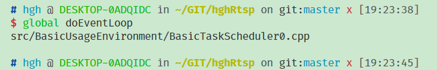
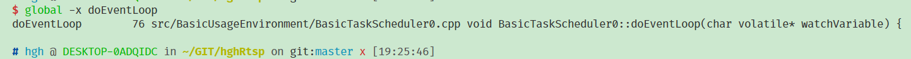
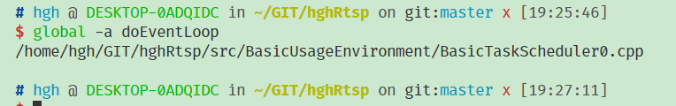
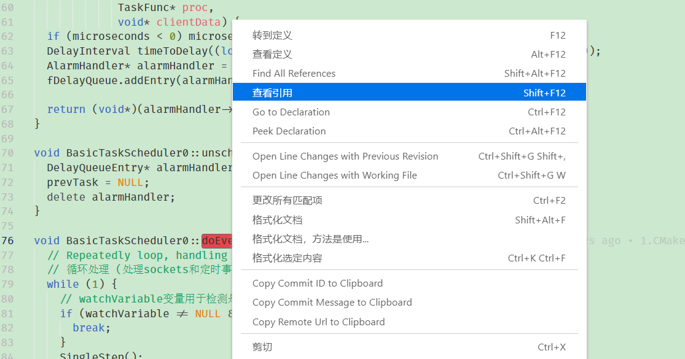

[TOC]

# gtags使用

# 链接

[GLOBAL官网](https://www.gnu.org/software/global/)

[工具使用笔记](http://blog.chinaunix.net/uid-20416834-id-120183.html)

## 简介

> 类似与ctags, 为代码添加标签, 对于C++, C语言更加精确, 不仅可以查看定义还可以查看引用.

## 安装

### 直接安装

```c++
$ sudo apt-get install global
```

### 源码安装

```c++
# 安装依赖库
$ sudo apt build-dep global
$ sudo apt install libncurses5-dev libncursew5-dev
# 下载源码
$ wget https://ftp.gnu.org/pub/gnu/global/global-6.6.tar.gz
# 编译和安装
$ ./configure --with-sqlite3
$ make -j4
$ sudo make install
```

## 使用

### 生成文件列表

```shell
# window环境
<<<<<<< HEAD
$ dir [path] /a-d /b /s *.cpp *.h > filelist.txt
$ dir lib\*.h lib\*.c include\*.h /A-D /B /s > filelist.txt
=======
$ dir [path] /a-d /b /s *.cpp *.c *.h > filelist.txt
>>>>>>> 5495476889f9a32468e68cf0c52998572d84bba2
# linux环境
$ find [path] -type f -regex ".*\(\.cpp\|\.c\)$" > filelist.txt
$ find . -type f \( -name "*.java" -o  -name "*.cpp" -o -name "*.h" \)
```

### 生成标签

> 使用gtags会生成三个文件GPATH,GTAGS,GRTAGS
>
> - GTAGS  -  所有变量, 函数定义的相关信息
> - GRTAGS - 所有变量, 函数被引用的相关信息
> - GPATH - 源代码每个文件的信息

```shell
# 递归当前目录
$ gtags
# 根据文件列表生成
$ gtags -f filelist
# 可以使用ctags解析gtags不支持的语言
$ gtags -f filelist --gtagslabel ctags
# 更新单个文件
$ gtags --single-update filename
```

### 查看文件内容

```shell
$ gtags --dump GPATH
$ gtags --dump GTAGS
$ gtags --dump GRTAGS
```

### global的使用

```shell
# 查看函数
$ global fun1
$ global 'func[1-3]'      // 支持 Posix 正则表达式
# 查看引用
$ global -r func
# 显示详细信息
$ global -x func
# 显示匹配的内容文件的完整路径
$ global -a func
# 显示不在GTAGS里面定义的symbols
$ global -s X
# 使用指定的模式定位
$ global -g "#ifdef"
# 定位某个文件
$ global -P fileB | '1/' | '\.c$'
# 查看某个文件的tags
$ global -f path/filename
# 在当前文件夹下检索
$ global -l func
# 忘记symbol名字, 可以使用-c进行提示
$ global -c create
```

## VSCode中gtags使用

```shell
# 生成只包含*.cpp和*.hh文件的文件列表
$ find . -type f \( -name "*.c" -o  -name "*.cpp" -o -name "*.hh" -o -name "*.h" \) > filelist.txt
# 在剔除build目录
$ find . \( -path "./build" \) -prune -o -type f \( -name "*.c" -o  -name "*.cpp" -o -name "*.hh" -o -name "*.h" \) > filelist.txt
# 更具filelist.txt生成标签
$ gtags -f filelist.txt
```

### 纯命令使用

#### 1.查看函数调用

```shell
$ global doEventLoop
```



#### 2.查看函数详细信息

```shell
$ global -x doEventLoop
```



#### 3.查看完整匹配路径

```shell
$ global -a doEventLoop
```



#### 4.查看引用

```shell
$ global -r doEventLoop  // 只显示文件名
$ global -rx doEventLoop // 显示完整的信息
```

### UI中的使用

> 右键需要查看的接口, 选择查看应用, 可以查看到所有调用该函数名的位置.

