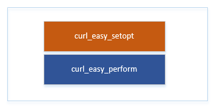

[TOC]

# Curl的编译

## 下载

- [curl](https://curl.haxx.se/download.html)      -支持文件的上传和下载.支持HTTP,HTTPS和FTP等各种协议.
- [zlib](http://www.zlib.net/)       -数据压缩功能 
- [openssl](https://oomake.com/download/openssl)   -安全套接字层密码库，囊括主要的密码算法、常用的密钥和证书封装管理功能及SSL协议
- [libssh2](https://www.libssh2.org/)     -SSH2是一套安全通讯协议框架
- [curl使用样例](https://curl.haxx.se/libcurl/c/example.html)

## curl的API使用

### 1. FTP的下载和上传

- 准备一个Ftp的服务器

## curl中HTTP的调用的流程分析

### HTTP-PUT 的调用

```c
curl_easy_setopt(curl, CURLOPT_URL, url);
curl_easy_setopt(curl, CURLOPT_HTTPHEADER, headers);
curl_easy_setopt(curl, CURLOPT_VERBOSE, HTTP_CRUL_VERBOSE_MODE);
curl_easy_setopt(curl, CURLOPT_NOPROGRESS, 1L);
curl_easy_setopt(curl, CURLOPT_PUT, 1L);
curl_easy_setopt(curl, CURLOPT_READFUNCTION, CB_ReadData);
curl_easy_setopt(curl, CURLOPT_READDATA, &restfulData);
curl_easy_setopt(curl, CURLOPT_INFILESIZE_LARGE, (curl_off_t)restfulData.readData.size);

curl_easy_setopt(curl, CURLOPT_HEADERFUNCTION, CB_ParseHeader);
curl_easy_setopt(curl, CURLOPT_HEADERDATA, &restfulData);
curl_easy_setopt(curl, CURLOPT_WRITEFUNCTION, CB_WriteData);
curl_easy_setopt(curl, CURLOPT_WRITEDATA, &restfulData);
curl_easy_setopt(curl, CURLOPT_NOSIGNAL, 1L);
curl_easy_setopt(curl, CURLOPT_CONNECTTIMEOUT_MS, 3000L);
res = curl_easy_perform(curl);
if (res != CURLE_OK)
{
    fprintf(stderr, "curl_easy_perform() failed: %s\n", 
            curl_easy_strerror(res));
}

curl_slist_free_all(headers);
curl_easy_cleanup(curl);
```

### 结构



### 参数的设置

> struct SessionHandle *data = curl;

URL

```c
data->change.url = data->set.str[STRING_SET_URL];
```

