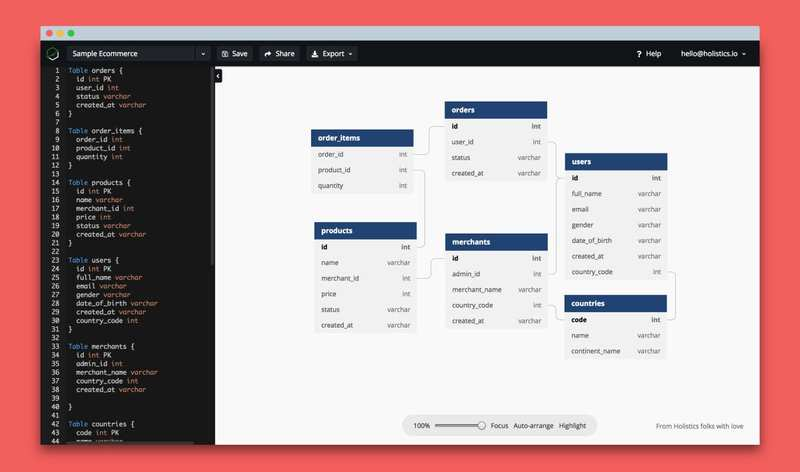
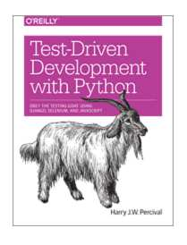

[TOC]

# WeekNote

## 第一期

日期: 2019-04-13

### 软件资料

[AV1](https://evilmartians.com/chronicles/better-web-video-with-av1-codec)                                                                -开源的视频编码和解码标准

[线程的通俗描述](https://www.internalpointers.com/post/gentle-introduction-multithreading)

[Learn Search](https://learn-anything.xyz/)

[node+qt](https://github.com/arturadib/node-five)

[Paste to Markdown](https://euangoddard.github.io/clipboard2markdown/)

[RTC](https://euangoddard.github.io/clipboard2markdown/)                                                       -  对redis进行内存结构分析

[google开源的图片压缩](https://github.com/GoogleChromeLabs/squoosh)

[Mac的平铺窗口管理器](https://koekeishiya.github.io/chunkwm/docs.html)

[StreamSaver.js](https://github.com/jimmywarting/StreamSaver.js) 				-流媒体保存成本地文件的浏览器库。

[你的电脑有多快？](https://computers-are-fast.github.io/)      			- 一个小游戏，提供一系列常见任务的 Python 脚本，让你猜计算机在1秒内可以执行多少次.

[OAuth2.0](http://www.ruanyifeng.com/blog/2019/04/oauth-grant-types.html)

[Kanban 与 Scrum 的比较](https://da-14.com/blog/kanban-vs-scrum-choosing-best-agile-project-management-framework)（英文）

Kanban 和 Scrum 都是敏捷开发的具体实现方法，本文讨论它们的异同.

[LFU 算法的一种实现](https://ieftimov.com/when-why-least-frequently-used-cache-implementation-golang)（英文）

LFU 是常用的删除过期缓存的算法，本文介绍了它的一种代码实现.

[dbdiagram.io](https://dbdiagram.io/home)

制作数据库关系图的在线工具

[BashUpload](https://bashupload.com/)

一个可以从命令行上传文件的网站，文件上传后可以保存七天，其间可以无限次下载

[PC Assembly Language](https://pacman128.github.io/pcasm/)

介绍汇编语言的本科生入门教材，有中文译本，免费下载

[ARM 汇编语言简介](http://bob.cs.sonoma.edu/IntroCompOrg-RPi/intro-co-rpi.html)

通过树莓派介绍 ARM 汇编语言的开源教材

[Visu Algo](https://visualgo.net/zh)

[JavaScript 模块简史](https://ponyfoo.com/articles/brief-history-of-modularity)（英文）

本文介绍历史上 JavaScript 各种模块方案的演变

[语言历史](https://howoldisit.glitch.me/#)

[day.js](https://github.com/iamkun/dayjs)

[Qt5 教程](https://qmlbook.github.io/)

开源电子书，介绍如何使用 Qt5，开发图形界面

[Go 语言编程风格的最佳实践](https://dave.cheney.net/practical-go/presentations/qcon-china.html)（英文）

作者谈了一些建议，如何编写可维护的 Go 语言代码。

[Livebook](https://livebook.manning.com/)

[黑客工具课程](https://hacker-tools.github.io/lectures/)

麻省理工学院的入门课程，介绍 Linux 系统使用者需要掌握的各种基本工具，适合刚入门的初级用户。

### 软件应用

[zsh终端](https://zhuanlan.zhihu.com/p/19556676)

[Generative.fm](https://generative.fm/)

该网站专门收集软件生成的音乐。比较奇特的是，这些音乐可以无限播放，并且每次听都不一样。暂停以后重新播放，你会听到跟前面不同的音乐。

[Test-Driven Web Development with Python](https://www.obeythetestinggoat.com/pages/book.html#toc)

免费的英文电子书，介绍如何以 TDD 的方式开发互联网应用，使用 Django 框架举例.

[算法](https://github.com/jeffgerickson/algorithms)

开源英文电子书，作者是美国伊利诺伊大学的教师，本书是他的讲课笔记，偏重于数学.

[Killed by Google](https://killedbygoogle.com/)

该网站收集谷歌关闭的所有自家产品

[航班实时追踪](http://flightadsb.variflight.com/)

国内做的全球航班实时位置展示，国内航班的覆盖是全球最好的

## 第二期

### 资料

### 应用

[Trac](https://trac.edgewall.org/wiki/TranslationZh_CN/TracGuide)

[Mercurial](https://www.mercurial-scm.org/)

[phpor的博客](https://phpor.net/blog/)

[香港地铁的颜色](http://metrocolor.live/index.html)

[AutoPiano](http://crystalworld.gitee.io/qpiano/#/)

[shutter截图工具](https://www.linuxidc.com/Linux/2019-04/157899.htm)

[ebook介绍](https://calibre-ebook.com/about)

[接口管理文档简介](https://www.kancloud.cn/yanshandou/kam2/598840)

[看云文档](https://www.kancloud.cn/explore)

[国标](http://www.gb688.cn/bzgk/gb/)

[fastcgi](https://fastcgi-archives.github.io/FastCGI_Developers_Kit_FastCGI.html#S2)

[月更新开源项目简介](https://github.com/521xueweihan/HelloGitHub)

[各种语言的Leetcode练习](https://github.com/tangweikun/awesome-leetcode#c)

[nginx学习笔记](https://github.com/y123456yz/reading-code-of-nginx-1.9.2)

[XWIKI](https://www.xwiki.org/xwiki/bin/view/Main/)

[微软的 Terminal](https://github.com/microsoft/Terminal/tree/master)

[数据库可视化软件Navicat](https://www.navicat.com/en/download/navicat-premium)

[Navicat激活](https://blog.csdn.net/jikefzz1095377498/article/details/79578796)

## 第三期

[阮一峰博客](http://www.ruanyifeng.com/home.html)

[50万行 Java 代码移植到 Go 语言的感想](https://blog.kowalczyk.info/article/19f2fe97f06a47c3b1f118fd06851fad/lessons-learned-porting-50k-loc-from-java-to-go.html)

[Flutter中文网](https://flutterchina.club/)

[Notion](https://www.notion.so/login)

[我的notion](www.notion.so/huguanghui)

[流媒体相关博客](http://www.cnblogs.com/haibindev/tag/%E6%B5%81%E5%AA%92%E4%BD%93/)

[2019 Google I/O中对Chrome的改进](https://www.codercto.com/topics/263.html)

[ReadtheDocs文档管理](https://readthedocs.org/dashboard/)

[录制屏幕生成 GIF](https://www.so.com/s?ie=UTF-8&q=LICEcap)

[中文文案排版](https://mazhuang.org/wiki/chinese-copywriting-guidelines/)

[GPROF工具使用](https://blog.csdn.net/luchengtao11/article/details/74910585)

[程序优化的5个方向](https://me115.github.io/2015/08/06/e7-a8-8b-e5-ba-8f-e4-bc-98-e5-8c-96-e7-9a-845-e4-b8-aa-e6-96-b9-e5-90-91/)

[visio2019](https://www.chiphell.com/thread-1920052-1-1.html)

[viso2019秘钥](https://blog.csdn.net/ysd880301/article/details/88360199)

## 第四期

[Five things that make Go fast](https://dave.cheney.net/2014/06/07/five-things-that-make-go-fast)

[voice-web](https://github.com/mozilla/voice-web)[Codelf Github](https://github.com/unbug/codelf)

[Codelf](https://unbug.github.io/codelf/)

[虚拟内存探究](http://blog.coderhuo.tech/2017/10/19/Virtual_Memory_summary/)

[博客-coderhuo](http://blog.coderhuo.tech/)

[C++ Core Guidelines](https://github.com/isocpp/CppCoreGuidelines/blob/master/CppCoreGuidelines.md)

[Go的开发路线](https://github.com/Alikhll/golang-developer-roadmap/blob/master/i18n/ReadMe-zh-CN.md)

[开发设计的原则和定律](https://github.com/nusr/hacker-laws-zh)

[数据结构和算法](https://github.com/wangzheng0822/algo)

[maskrcnn-benchmark](https://github.com/facebookresearch/maskrcnn-benchmark)

[ 3D 游戏实施 SSAO、景深、照明、法线贴图等效果的教程](https://github.com/lettier/3d-game-shaders-for-beginners)

[ctags](http://ctags.sourceforge.net/)

[FiraCode字体](https://github.com/tonsky/FiraCode)

[ubuntu下安装字体](https://blog.csdn.net/bitcarmanlee/article/details/79729634)

[Chocolatey](https://chocolatey.org/) - Windows上的安装包管理

[字体安装](http://www.360kuai.com/pc/9d11114e6873c2292?cota=3&kuai_so=1&tj_url=xz&sign=360_e39369d1&refer_scene=so_1)[字体格式的区分](http://www.360doc.com/content/14/1011/10/14573610_416005436.shtml)

[TeaHour播客](http://teahour.fm/)

[配置文件](https://github.com/shibayu36/config-file)

[常用工具](https://www.bejson.com/)

[cplusplus中的string的使用](http://www.cplusplus.com/reference/string/string/)

[go的excel库使用](https://github.com/360EntSecGroup-Skylar/excelize)

[Sylar的博客](http://www.sylar.top/blog/)

## 第五期

[初音Cloud云加速](https://91fastvpn.com/)

[佰阅部落](https://baiyue.one/)

[Consen博客](https://consen.github.io/)

[linux终端命令录制工具](https://baiyue.one/archives/257.html)

[ranger使用](https://www.52gvim.com/)

[速查表](https://www.cnblogs.com/findumars/p/8480368.html)

[cheatsheet](https://devhints.io/)

人脸识别相关

[OAID 仓库](https://github.com/OAID)

[YSQ 仓库](https://github.com/ShiqiYu)

[Caffe](http://caffe.berkeleyvision.org/)

[alibaba开源](https://github.com/alibaba?utf8=%E2%9C%93&q=&type=&language=c)

[切图](https://icons8.com/)

[usbguard](https://github.com/USBGuard/usbguard)

[经典书籍文档](https://github.com/royeo/awesome-programming-books)
[manjaro的安装和配置](http://ju.outofmemory.cn/entry/359698)

[i3 官网](https://i3wm.org/)

[i3 按键](https://i3wm.org/docs/userguide.html#_default_keybindings)

[gythialy 的博客](https://gythialy.github.io/)

[技术博客](http://outofmemory.cn/#cpp.cnblogs)

## 第六期

[Linux 系统的时间线](https://github.com/FabioLolix/LinuxTimeline)

[用飞桨来实现您的AI想法](http://www.paddlepaddle.org.cn/start)

### 打字

[typngclub](https://www.typingclub.com)

[keybr](https://www.keybr.com)

[typingtest](https://www.typingtest.com)

[10fastfinger](https://10fastfinger.com)

[C/C++资源表](https://www.ctolib.com/cpp/)

[polybar的几个推荐主题](https://linux.ctolib.com/adi1090x-polybar-themes.html)

[nvim配置](https://github.com/theniceboy/nvim)

[Intel 神经棒](https://software.intel.com/zh-cn/neural-compute-stick)

[NCS的github仓库](https://github.com/movidius/ncsdk.git)

[vagrant虚拟器](https://www.vagrantup.com/intro/getting-started/install.html)

[linuxtoy](https://linuxtoy.org/pages/all-archives.html)

[lulinux](https://www.lulinux.com/)

[Latex官网](https://www.latex-project.org/)

##  第七期

