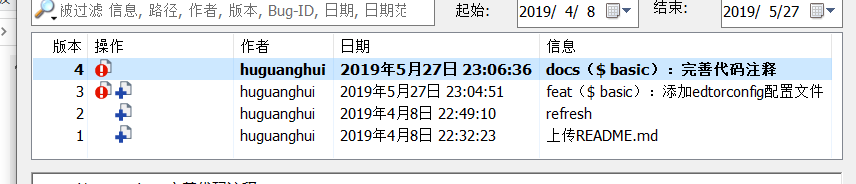

[TOC]

# SVN和GIT使用

## 修改记录

|    日期    |   描述   | 版本  |  作者  | 审核 |
| :--------: | :------: | :---: | :----: | :--: |
| 2019-04-07 | 初始版本 | 1.0.0 | 胡光辉 |      |
|            |          |       |        |      |
|            |          |       |        |      |

[visualsvn入门文档](https://www.visualsvn.com/server/getting-started/)

## SVN

### svn status的状态显示

- A 已添加
- D 已删除
- U 已更新
- C 合并冲突
- G 合并成功
- E 已存在
- R 已替换

### 检出

```shell
svn checkout svn路径
```

### 多行上传

```shell
# svn多行上传
$ svn commit -m $'1.测试;\n2.上传文件;\n3.完善注释;\n'
```

### 更新到指定版本

```shell
$svn update -r 200 test.php
```

### 版本回退

#### 版本未提交

```shell
# 回退文件
$ svn revert 文件名
# 取消目录
$ svn revert --depth=infinity 目录名
或
$ svn revert -R 目录
```

#### 版本已提交

> 将版本4回退到版本2



```shell
# 1. 保证当前的是最新的代码
$ svn update 
# 2. 查看日志确定需要回滚的版本号
$ svn log
# 3. 对比两个版本的差异
$ svn diff -r 4:3 ""
# 4. 回滚版本
$ svn merge -r 4:3 ""
# 5. 确认修改
$ svn diff ""
# 6. 提交
$ svn commit -m $'Revert revision from r4 to r25. 测试版本回退流程.'
```

### 显示一个历史版本中指定文件的内容

```shell
$ svn cat -r 版本号 文件
```

### 在不下载文件到本地目录的情况下来察看目录中的文件

```shell
$ svn list https://192.168.3.125/svn/test_svn
```

### 分支的使用

```shell
# 创建分支
$ svn cp -m "create branch" http://svn_server/xxx_repository/trunk http://svn_server/xxx_repository/branches/br_feature001
# 获取分支
$ svn co http://svn_server/xxx_repository/branches/br_feature001
# 合并主干上的最新代码到分支
$ cd br_feature01
$ svn merge http://svn_server/xxx_repository/trunk 
# 分支合并到主干
$ cd trunk
$ svn merge --reintegrate http://svn_server/xxx_repository/branches/br_feature001
# 合并版本并将合并后的结果应用到现在的分支
$ svn -r 148:149 merge http://svn_server/xxx_repository/trunk
```

### 标签的使用

```shell
# 新建tag
$ svn copy http://svn_server/xxx_repository/trunk http://svn_server/xxx_repository/tags/release-1.0 -m "1.0 released"
```

### 删除分支或tag

```shell
$ svn rm http://svn_server/xxx_repository/branches/br_feature001
$ svn rm http://svn_server/xxx_repository/tags/release-1.0
```

### 使用vimdiff替换原生的1svn diff

新建文件~/.vimdiff

```
1 #!/bin/sh
2 # 配置你喜欢的diff程序路径
3 DIFF="vimdiff"
4 # SVN diff命令会传入两个文件的参数 
5 LEFT=${6}
6 RIGHT=${7}
7 # 拼接成diff命令所需要的命令格式
8 $DIFF $LEFT $RIGHT
```

编辑subversiond的配置文件

```shell
# diff-cmd = diff_program (diff, gdiff, etc.)替换为diff-cmd = /home/user-name/.vimdiff
```

### 特殊使用

```shell
# 修改 svn 的地址
$ svn switch --relocate http://192.168.1.4/svn/zview_4sdi_dvr/firmware/projects_2018/07_AHB8308HIB_AiStick/zwsdk http://192.168.250.4/svn/zview_4sdi_dvr/firmware/projects_2018/07_AHB8308HIB_AiStick/zwsdk
```


## GIT

### 已修改的版本回滚

### 当前目录切换到历史版本